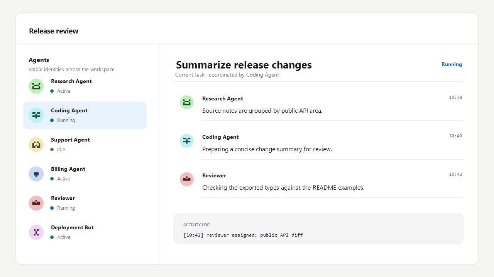
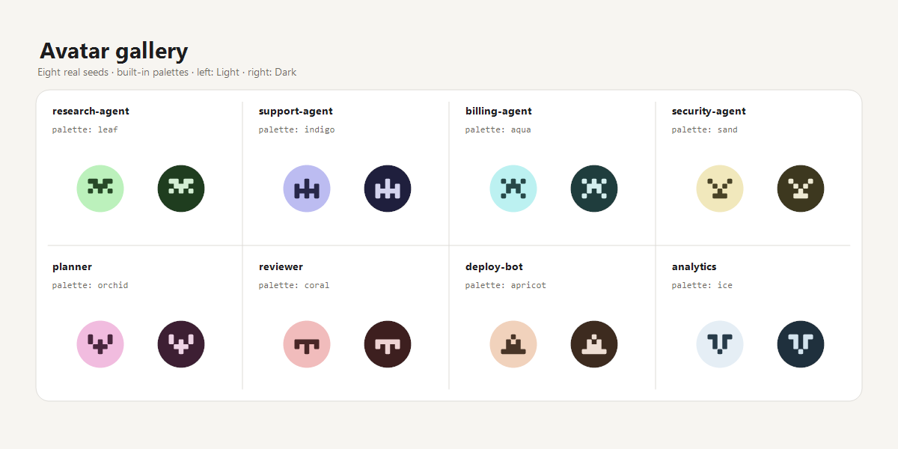
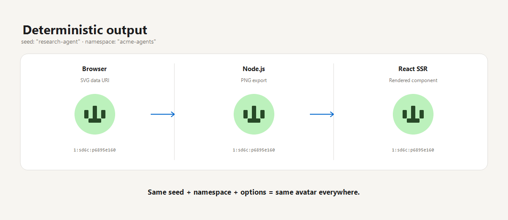
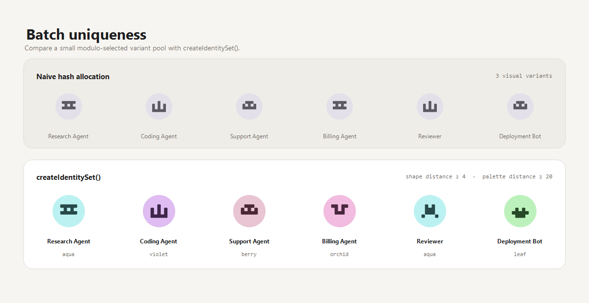
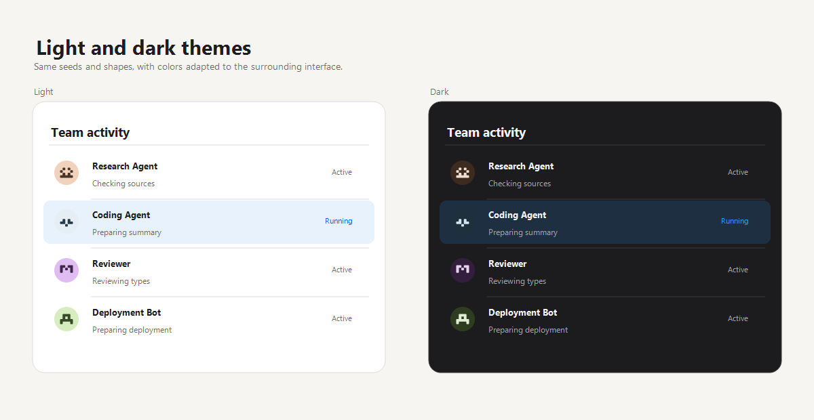
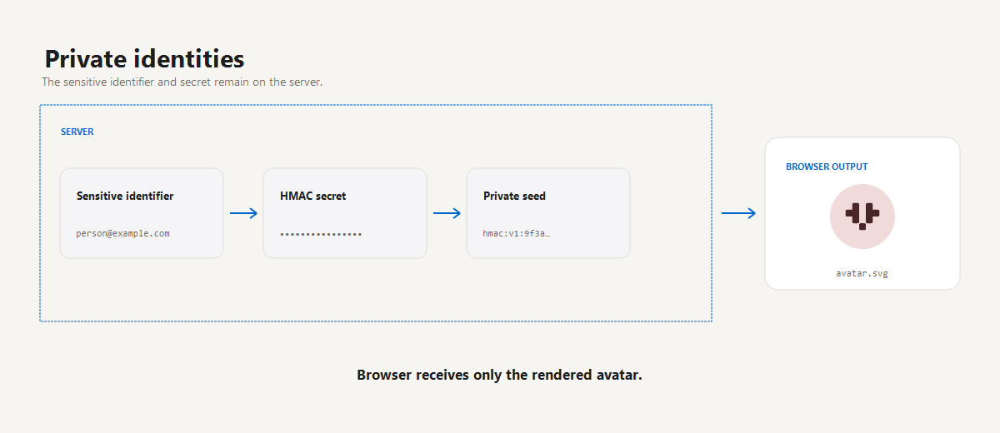

<p align="center">
  
</p>

# Agent Avatars

Zero-dependency deterministic SVG and PNG avatars for AI agents, bots, services, and users.



*Stable visual identities for AI agents, bots and services.*

The GitHub Pages-ready demo is `index.html`. Run it locally through a static server:

```bash
npm run demo
```

Then open `http://localhost:4173/`. ES modules are not supported reliably when the file is opened directly with `file://`.

## Installation

```bash
npm install agent-avatars
```

Install from the npm registry. Direct Git URL installs are not supported because generated `dist` files are intentionally not tracked.

## Quick start

```ts
import { createHashAvatar } from "agent-avatars";

const svg = createHashAvatar("research-assistant", {
  namespace: "my-project",
  theme: "dark",
  size: 96,
});
```

The same seed, namespace, and options always produce the same result.

## Avatar gallery



Each card uses a real seed and built-in palette. The paired previews show the same identity in light and dark themes.

## Deterministic output



The same seed, namespace, and options resolve to the same shape and palette in browser SVG, Node.js PNG output, and server-rendered React.

## Batch uniqueness



`createIdentitySet()` can enforce exact signature uniqueness and optional shape or palette distance across a group, making agents easier to distinguish than a small modulo-selected variant pool.

## Light and dark themes



Theme changes adapt the colors without changing each agent's deterministic shape or palette identity.

## Private identities



Generate stable avatars from sensitive identifiers without exposing the original seed. Private derivation belongs on the server; never embed the HMAC secret in browser code.

```js
import { derivePrivateSeed } from "agent-avatars/private";

const privateSeed = await derivePrivateSeed("person@example.com", {
  namespace: "my-project",
  secret: process.env.AVATAR_HMAC_SECRET,
});
```

## API reference

### React

```tsx
import { AgentAvatar } from "agent-avatars/react";

export function ResearchAssistant() {
  return (
    <AgentAvatar
      seed="research-assistant"
      size={64}
      options={{ namespace: "my-project", theme: "dark" }}
      alt="Research assistant"
    />
  );
}
```

React 18 or 19 is an optional peer dependency.

TypeScript consumers must use TypeScript 4.7 or newer with `Node16`, `NodeNext`, or `Bundler` module resolution. Legacy `node10` subpath resolution is not supported.

### Package entry points

| Entry | Environment | Purpose |
| --- | --- | --- |
| `agent-avatars` | Browser and Node.js | Descriptors, SVG/data URI rendering, catalog inspection, and identity sets. |
| `agent-avatars/react` | Browser and Node.js SSR | React 18/19 `<AgentAvatar>` component. |
| `agent-avatars/png` | Node.js | Synchronous PNG encoding and filesystem export. |
| `agent-avatars/private` | Node.js | HMAC-derived private seeds and avatars. |

### SVG and PNG export

```js
import { writeFileSync } from "node:fs";
import { createHashAvatar } from "agent-avatars";
import { createAvatarPng, writeAvatarPngSet } from "agent-avatars/png";

const seed = "research-assistant";
const options = { namespace: "my-project", theme: "light" };

writeFileSync("avatar.svg", createHashAvatar(seed, { ...options, size: 200 }));
writeFileSync("avatar-64.png", createAvatarPng(seed, { ...options, size: 64 }));

writeAvatarPngSet(seed, "./avatars", {
  ...options,
  sizes: [32, 64, 192, 200],
  baseName: "research-assistant",
});
```

SVG generation works in browsers and Node.js. PNG generation and filesystem export use Node.js built-ins.

PNG rendering caps its high-resolution RGBA buffer at 64 MiB. When `supersample` is omitted, large outputs automatically use the highest safe value up to the default of 4. If an explicit `supersample` value exceeds that budget, the API throws a `RangeError`; lower the output size or the supersampling value.

PNG generation is synchronous. Do not forward an untrusted request size directly to the PNG API: apply an application-level allowlist (typically no more than 512 or 1024 pixels) and run unusually large exports in a worker or background job.

PNG-only options are `supersample` (integer `1..8`), `sizes` (unique integer output sizes), and `baseName` for filesystem export. `createAvatarPngFromDescriptor` accepts only `supersample`, because palette, namespace, and identity selection are already fixed by the descriptor.

### Options

| Option | Purpose |
| --- | --- |
| `namespace` | Separates the same seed across products, tenants, or environments. |
| `namespaceMode` | Uses normalized `"human"` or exact `"raw"` namespace input. |
| `theme` | Selects `"light"` or `"dark"`. |
| `size` | Sets the rendered SVG or PNG size. |
| `seedMode` | Uses normalized `"human"` input or exact `"raw"` input. |
| `palette` | Selects a built-in palette or supplies a custom light/dark palette. |
| `palettes` | Supplies a deterministic custom palette collection. |
| `collisionNonce` | Selects an alternate candidate for a single avatar; `createIdentitySet` does not accept it. |
| `minimumContrast` | Sets custom-palette contrast validation in the range `1..21`. |
| `allowLowContrast` | Explicitly permits lower contrast; only a boolean is accepted. |
| `minPixels`, `maxPixels` | Restrict the number of active cells in catalog shapes. |
| `minDensity`, `maxDensity` | Restrict active-cell density within shape bounds. |
| `maxDiagonalConnections`, `connectivity`, `maxHoles` | Configure structural shape constraints. |

Avatar generation uses the Standard shape catalog. The demo does not expose alternate shape presets.

Custom colors must be six-digit hexadecimal values. Contrast is validated by default.

Malformed types and unsupported enum values throw `TypeError`. Values outside documented capacity or resource bounds throw `RangeError`. Deterministic allocation exhaustion and incompatible persisted assignments throw `Error`; callers should treat manifests as versioned data and keep the prior valid snapshot when growth fails.

### Batch allocation details

Batch allocation normally enforces exact signature uniqueness: two different identities cannot receive the same shape-and-palette signature. You can also opt in to **visual distinguishability**, which keeps assignments a requested shape or palette distance apart. This policy is opt-in only; omitting the distance options leaves the existing defaults and exact-uniqueness behavior unchanged.

```js
import { createIdentitySet } from "agent-avatars";

const team = createIdentitySet(["research", "support", "billing"], {
  ensureUnique: true,
  minimumShapeDistance: 4,
  minimumPaletteDistance: 20,
  distanceMode: "either",
});
```

`minimumShapeDistance` is Hamming distance across the full rendered 5 × 4 bitmap: it counts cells that differ, so its range is `0..20`. `minimumPaletteDistance` uses the versioned `visual-distance/v1` metric. Colors are converted from sRGB to D65 Lab and compared with CIEDE2000. Within each theme, background and foreground differences are combined as a weighted RMS using 85% background and 15% foreground; the palette distance is `min(light, dark)`. Taking the minimum guarantees the threshold after switching to either theme. For example, the built-in rose and coral palettes have distance 0 because one theme is visually identical under this metric.

Each channel is disabled by a threshold of `0`. `minimumShapeDistance` must be an integer in `0..20`; `minimumPaletteDistance` must be a finite number in `0..100`; and `distanceMode` must be `"either"` or `"both"`. If both thresholds are zero, no visual-distance policy is stored or applied.

`ensureUnique` and `includeSvg` accept booleans only. `manifest` supplies a prior allocation snapshot and `maxAttempts` caps deterministic candidate attempts for each new identity.

| Enabled channels | `distanceMode` | A pair is accepted when |
| --- | --- | --- |
| Shape only | `either` or `both` | Shape distance meets its threshold |
| Palette only | `either` or `both` | Palette distance meets its threshold |
| Shape and palette | `either` | Shape **OR** palette meets its threshold |
| Shape and palette | `both` | Shape **AND** palette meets its threshold |

`either` is the default: one strong visual cue is sufficient, so two avatars may use the same palette when their shapes are distant enough. Use `both` when every pair must differ sufficiently in both channels; it is stricter and best suited to smaller sets. Exact signature uniqueness is still enforced with either policy. Repeating the same identity in the input reuses its one assignment rather than consuming another signature.

Without a visual-distance policy, `ensureUnique: false` permits repeated signatures and sets larger than the configured signature state space. The returned manifest remains reusable when subsequent calls also set `ensureUnique: false`. Switching such a manifest back to unique allocation is rejected if its historical entries contain duplicate signatures or exceed the state space. `getCatalogStats().signatureStates` reports this exact signature capacity; it is not a promise that every palette looks different in every theme.

#### Growing a set with a manifest

```js
import { createIdentitySet } from "agent-avatars";

const policy = {
  namespace: "my-project",
  ensureUnique: true,
  minimumShapeDistance: 4,
  minimumPaletteDistance: 20,
  distanceMode: "either",
};

const first = createIdentitySet(["research", "support", "billing"], policy);

const expanded = createIdentitySet(["research", "support", "billing", "release"], {
  ...policy,
  manifest: first.manifest,
});
```

The manifest stores the complete distinguishability policy, including its `visual-distance/v1` schema. Reuse the manifest when a set grows: historical assignments stay unchanged and constrain every new assignment. The requested policy must match the stored policy exactly, or hydration is rejected. A manifest is also checked pairwise, so a tampered set that no longer satisfies its stored policy is rejected.

Manifest compatibility also includes `seedMode`. A manifest created with `seedMode: "human"` is rejected under `"raw"`, and vice versa. Because `1.0.0-rc.2` adds this binding, manifests produced by `1.0.0-rc.1` are intentionally incompatible and must be regenerated.

#### Capacity and allocation limits

Allocation uses a greedy deterministic allocator. It considers identities in a stable order and tries at most `maxAttempts` deterministic candidates for each new identity. It does not guarantee a maximum packing and failure does not prove that no valid assignment exists elsewhere in the state space. Capacity can fall sharply with higher thresholds, especially in `both` mode.

If deterministic allocation attempts are exhausted, the error reports the accepted count, thresholds, mode, and attempt limit. Try lowering one or both thresholds, adding palettes, or increasing `maxAttempts`. Allocation also fails early if the requested exact-unique set is larger than the configured signature state space.

To bound synchronous aggregate work, one call accepts at most 256 custom palettes, 10,000 seeds, and 10,000 manifest entries. A PNG set accepts at most 64 sizes and at most 16,777,216 high-resolution render pixels in total after supersampling. Inputs over these limits are rejected before entries are normalized or images are rendered.

Custom palettes participate in the same rules. Exact signatures use a 32-bit key derived from the palette colors; selected custom palettes with different colors but a colliding palette signature key are rejected rather than treated as interchangeable.

### Security limitations

- Deterministic output is not anonymization; a known seed and options can be reproduced.
- A namespace separates collections but is not a secret.
- For sensitive identifiers, use the Node-only `agent-avatars/private` subpath described in [Private identities](#private-identities).
- Never embed a private secret in browser code or commit it to a repository.
- Generate at least 32 random secret bytes, store them in a secret manager, attach a key identifier to persisted data, and plan key rotation. The private API rejects secrets shorter than 32 encoded bytes; length validation does not replace entropy. A long human-readable password is not a substitute for random entropy.
- Validate untrusted manifests before storing or reusing them; the library rejects incompatible manifest schemas and options.

## Support

If this project is useful to you, you can support its development on Ko-fi:

[](https://ko-fi.com/felixkoba)

## Development checks

Runtime consumers support Node.js 18 and newer. Repository development and releases require Node.js 24.8 or newer and npm 11.11.0; `.nvmrc` selects the tested Node 24 line.

`npm test` builds clean artifacts, runs runtime and strict declaration tests, validates the demo HTML, installs a real tarball into isolated ESM/CJS/TypeScript/browser-bundler consumers, renders the React component, and audits the packed package with publint and Are The Types Wrong. The default suite avoids maximum-size PNG allocation. Run `npm run test:stress` separately when the environment can accommodate the 4096 × 4096 PNG boundary case and its greater-than-128-MiB peak memory usage. `npm run release:dry-run` exercises the real publish lifecycle with the required prerelease dist-tag. After installing Chromium with `npx playwright install chromium`, `npm run test:release` runs the browser, stress, publication, and dependency-audit gates without publishing.

## MIT License

Copyright (c) 2026 Felix Koba. See [LICENSE](LICENSE).
