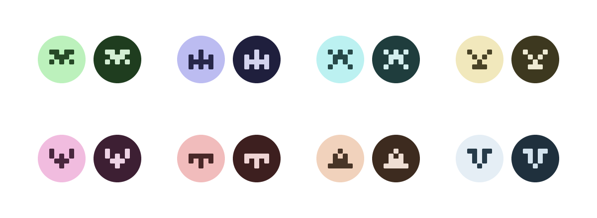

<p align="center">
  
</p>

# Agent Avatars

[](https://www.npmjs.com/package/agent-avatars)
[](https://www.npmjs.com/package/agent-avatars)
[](https://github.com/NotXf1le/agent-avatars/blob/main/LICENSE)

Generate deterministic SVG and PNG avatars from stable identifiers. The package has no runtime dependencies and supports browsers, Node.js, React 18/19, SSR, ESM, and CommonJS.

**[Try the generator](https://notxf1le.github.io/agent-avatars/)** · [Documentation](https://notxf1le.github.io/agent-avatars/docs/) · [React](https://notxf1le.github.io/agent-avatars/react/) · [Identity sets](https://notxf1le.github.io/agent-avatars/identity-sets/) · [Private avatars](https://notxf1le.github.io/agent-avatars/private-avatars/) · [Examples](https://notxf1le.github.io/agent-avatars/examples/)

## Install

```bash
npm install agent-avatars
```

## Quick start

```ts
import { createHashAvatar } from "agent-avatars";

const svg = createHashAvatar("agent-42", {
  namespace: "my-product/agents",
  theme: "dark",
  size: 96,
});
```

The same seed, namespace, and identity-selection options produce the same avatar.

```ts
import { avatarDataUri } from "agent-avatars";

const src = avatarDataUri("agent-42", {
  namespace: "my-product/agents",
  size: 48,
});
```

`avatarDataUri()` returns a local SVG data URI for ``, provided the application's Content Security Policy allows `data:` images.

## Stable IDs and namespaces

Use a stable ID, such as a database key, as the seed. By default, casing and surrounding whitespace are ignored, so `"Agent-42"` and `"agent-42"` produce the same avatar.

If IDs are case-sensitive, set `seedMode: "raw"`. `namespaceMode` provides the same control for namespaces.

Set a namespace when the same ID can appear in more than one product or identity collection.

## Output gallery



Theme changes the selected palette colors without changing the underlying shape or palette family.

## React

```tsx
import { AgentAvatar } from "agent-avatars/react";

export function AgentBadge({ id, name }: { id: string; name: string }) {
  return (
    <AgentAvatar
      seed={id}
      size={48}
      options={{ namespace: "my-product/agents", theme: "dark" }}
      alt={`${name} avatar`}
    />
  );
}
```

React is an optional peer dependency. The component renders an ordinary `` and supports refs, image attributes, and server rendering.

## PNG and file export

The Node-only PNG entry point returns synchronous PNG bytes and can write a platform-size set atomically.

```js
import { writeFileSync } from "node:fs";
import { createAvatarPng, writeAvatarPngSet } from "agent-avatars/png";

writeFileSync(
  "agent-42.png",
  createAvatarPng("agent-42", {
    namespace: "my-product/agents",
    size: 128,
  }),
);

writeAvatarPngSet("agent-42", "./avatars", {
  namespace: "my-product/agents",
  sizes: [32, 64, 192, 200],
  baseName: "agent-42",
});
```

PNG sizes must be integers from 1 to 4096. `supersample` accepts integers from 1 to 8; when omitted or set to `null`, the renderer selects the highest safe value up to 4. A single high-resolution RGBA render buffer is capped at 64 MiB.

PNG generation is synchronous. For untrusted requests, enforce a smaller application-level size allowlist and move unusually large exports off the request thread.

## Distinct identity sets

`createIdentitySet()` assigns stable shape-and-palette signatures across a group and returns a manifest that preserves earlier assignments when the group grows.

```js
import { createIdentitySet } from "agent-avatars";

const options = {
  namespace: "my-product/agents",
  minimumShapeDistance: 4,
  minimumPaletteDistance: 20,
  distanceMode: "either",
};

const first = createIdentitySet(["research", "support", "billing"], options);

const expanded = createIdentitySet(
  ["research", "support", "billing", "release"],
  { ...options, manifest: first.manifest },
);
```

With both thresholds enabled, `distanceMode: "either"` lets avatars differ sufficiently in shape or color. `"both"` requires both differences.

Reuse the returned manifest when adding identities so existing assignments remain unchanged. Strict thresholds can make large sets impossible; see the [identity-set guide](https://notxf1le.github.io/agent-avatars/identity-sets/) for sizing and fallback behavior.

## Sensitive identifiers

Do not generate public avatars directly from email addresses or other guessable identifiers. Derive a private seed on the server with the Node-only private entry point.

```js
import { createPrivateHashAvatar } from "agent-avatars/private";

const svg = await createPrivateHashAvatar("person@example.com", {
  namespace: "my-product/users",
  secret: process.env.AVATAR_HMAC_SECRET,
  size: 96,
});
```

Use at least 32 random secret bytes and keep the secret on the server.

## Entry points

| Entry | Runtime | Main use |
| --- | --- | --- |
| `agent-avatars` | Browser and Node.js | SVG, data URIs, descriptors, catalog inspection, and identity sets |
| `agent-avatars/react` | Browser and Node.js SSR | React 18/19 `<AgentAvatar>` |
| `agent-avatars/png` | Node.js | PNG bytes, data URIs, and atomic filesystem export |
| `agent-avatars/private` | Node.js | HMAC-derived private seeds and SVG avatars |

## Common options

| Option | Default | Meaning |
| --- | --- | --- |
| `namespace` | `"default"` | Separates identity collections |
| `namespaceMode` | `"human"` | Normalized or exact namespace input |
| `seedMode` | `"human"` | Normalized or exact seed input |
| `theme` | `"light"` | `"light"` or `"dark"` colors |
| `size` | `96` | SVG or PNG dimensions |
| `palette` | `"auto"` | Built-in palette name, index, or custom palette |
| `palettes` | built-ins | Custom deterministic palette collection |
| `collisionNonce` | `0` | Alternate candidate for one avatar; unavailable to identity sets |
| `minimumContrast` | `4.5` | Required custom-palette contrast ratio |
| `allowLowContrast` | `false` | Explicitly permits a custom palette below the threshold |

Custom colors must be six-digit hexadecimal values. Malformed types, non-finite numbers, and unsupported enum values throw `TypeError`; finite values outside supported ranges and resource limits throw `RangeError`.

TypeScript consumers need TypeScript 4.7 or newer with `Node16`, `NodeNext`, or `Bundler` module resolution.

## Resource limits

- Up to 256 custom palettes per call.
- Up to 10,000 seeds and 10,000 manifest entries per identity-set call.
- Up to 64 sizes and 16,777,216 high-resolution render pixels per PNG set.
- SVG and PNG output sizes are capped at 4096 pixels.

Inputs beyond these limits are rejected before allocation or rendering.

## Security notes

- Deterministic output is not anonymization: anyone who knows a seed and its options can reproduce the avatar.
- Never treat a namespace as a secret.
- Keep HMAC secrets server-side and use random secret material, not a human password.
- Validate and version persisted manifests before reusing them.
- Apply application-level quotas when PNG generation is reachable from untrusted input.

See [SECURITY.md](SECURITY.md) for the supported versions and reporting process.

## Development

Runtime consumers support Node.js 18 and newer. Repository development and releases require Node.js 24.8 or newer and npm 11.11.0.

```bash
npm ci
npm test
```

`npm run test:stress` exercises the 4096 × 4096 PNG boundary separately. `npm run release:dry-run` validates the expected npm dist-tag and inspects `npm pack --dry-run`; it does not publish.

Run the live demo locally with `npm run demo`, then open `http://localhost:4173/`.

## Support

[](https://ko-fi.com/felixkoba)

## License

MIT © 2026 Felix Koba. See [LICENSE](LICENSE).
